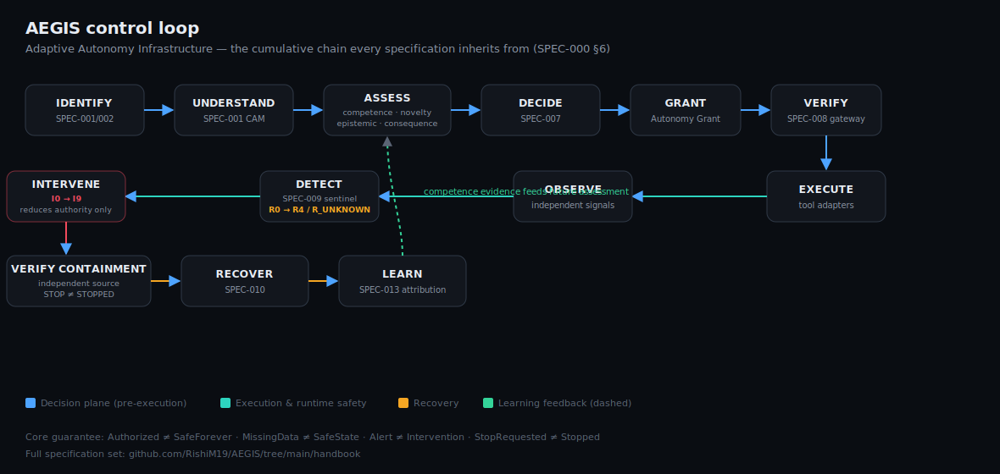

# AEGIS

**Adaptive Autonomy Infrastructure for AI Agents**

[](https://github.com/RishiM19/AEGIS/actions/workflows/ci.yml)
[](https://github.com/RishiM19/AEGIS/actions/workflows/ci.yml)
[](https://aegis-dashboard-woad.vercel.app)

Most AI-agent safety today is a static permission check: *is this identity allowed to call this tool?* AEGIS asks a harder question instead — *given this exact action, this agent's actual track record, how novel the situation is, how bad it could go, and whether it can be undone, how much independence should this agent get, right now?* It's the difference between a firewall rule and a judgment call, made automatically, consistently, and auditably, thousands of times a second.

**[→ Live dashboard](https://aegis-dashboard-woad.vercel.app)** — runs the full pipeline live on every request, no mocked data.

<a href="https://aegis-dashboard-woad.vercel.app">
  
</a>

## What's actually implemented vs. designed

- **Designed:** 19 full technical specifications (SPEC-000 → SPEC-018), each with domain objects, numbered invariants, failure behavior, security boundaries, and adversarial scenarios — see [`handbook/`](handbook/).
- **Implemented:** every one of those specifications as real, tested TypeScript in [`packages/core`](packages/core) — Agent Registry, four independent assessment engines, the autonomy decision engine, execution gateway, runtime sentinel, recovery engine, approval coordinator, learning plane, delegation graph, anti-gaming detection, and a benchmark harness — 128 tests, all green, wired end-to-end in the live dashboard above.

## Why this is hard

A static permission system only has one lever: allow or deny. AEGIS has to get several harder things right at once, and keep them from silently collapsing into each other:

- **Competence isn't one number.** An agent that's flawless at small domestic refunds may be unproven on international fraud disputes. Collapsing that into a single trust score throws away exactly the information that matters (`SPEC-003`).
- **Confidence in evidence when evidence is thin.** Two successful outcomes and a hundred successful outcomes should not earn the same autonomy, even at the same 100% success rate — the dashboard's baseline comparison shows this failure mode directly: a naive trust-score system over-grants autonomy on sparse evidence; AEGIS's confidence-aware competence engine doesn't.
- **A valid decision can become unsafe mid-flight.** Authorization is not permanent safety. The Runtime Sentinel has to detect danger *during* execution and intervene — and then verify the intervention actually worked, because `STOP ≠ STOPPED`.
- **Recovery is not the same as containment.** Stopping further harm doesn't undo harm already done — that's a distinct, separately governed problem (`SPEC-010`).
- **No single component gets to be the final word.** Competence, risk, novelty, and uncertainty are assessed independently and combined as a strict minimum, so one favorable signal can never paper over one dangerous one (`SPEC-007`).

## Architecture



Full write-up of every plane, invariant, and guarantee: [`handbook/aegis-master-context.md`](handbook/aegis-master-context.md).

## Repository Layout

```text
handbook/          Canonical specifications (SPEC-000 through SPEC-018),
                    architecture decisions, research thesis, spec roadmap.
AGENTS.md          Operating contract for any AI coding agent working here.
packages/
  contracts/       @aegis/contracts -- Canonical Action Model (SPEC-001),
                    Agent Identity types (SPEC-002), fingerprinting.
  core/            @aegis/core -- every governance engine: registry,
                    assessment, decision, execution, runtime safety,
                    recovery, learning, delegation, anti-gaming, research.
apps/
  web/             The live benchmark dashboard (Next.js, deployed to Vercel).
docs/              Diagrams and other portfolio-facing assets.
```

## Before You Read Any Further (if you're contributing)

Read [AGENTS.md](AGENTS.md) first, then [handbook/aegis-master-context.md](handbook/aegis-master-context.md), then [handbook/AEGIS-ARCHITECTURE-DECISIONS.md](handbook/AEGIS-ARCHITECTURE-DECISIONS.md). Every specification is a cumulative contract — see `AGENTS.md` for what that means before editing anything under `handbook/`.

## Development

This is an npm-workspaces monorepo.

```bash
npm install
npm run build --workspaces --if-present
npm run test --workspaces --if-present

# run the dashboard locally
npm run dev --workspace=apps/web
```

## Status

Design phase (SPEC-000 through SPEC-018) is complete. The V1 decision/execution/runtime-safety/recovery/learning pipeline is implemented and tested in `@aegis/core`, proven end-to-end against the flagship autonomous-refund benchmark, and live in the dashboard above — per the V1 Boundary Philosophy (`handbook/SPEC-000.md` §65): one benchmark domain, built deeply, before broadening scope.
